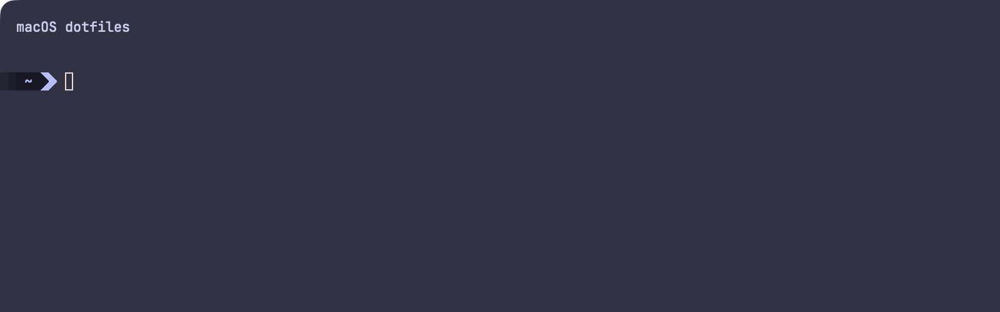
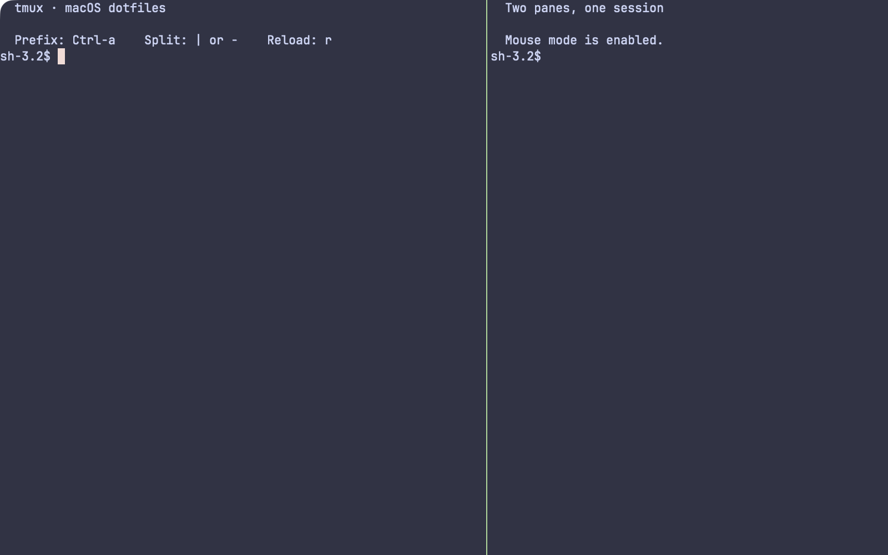
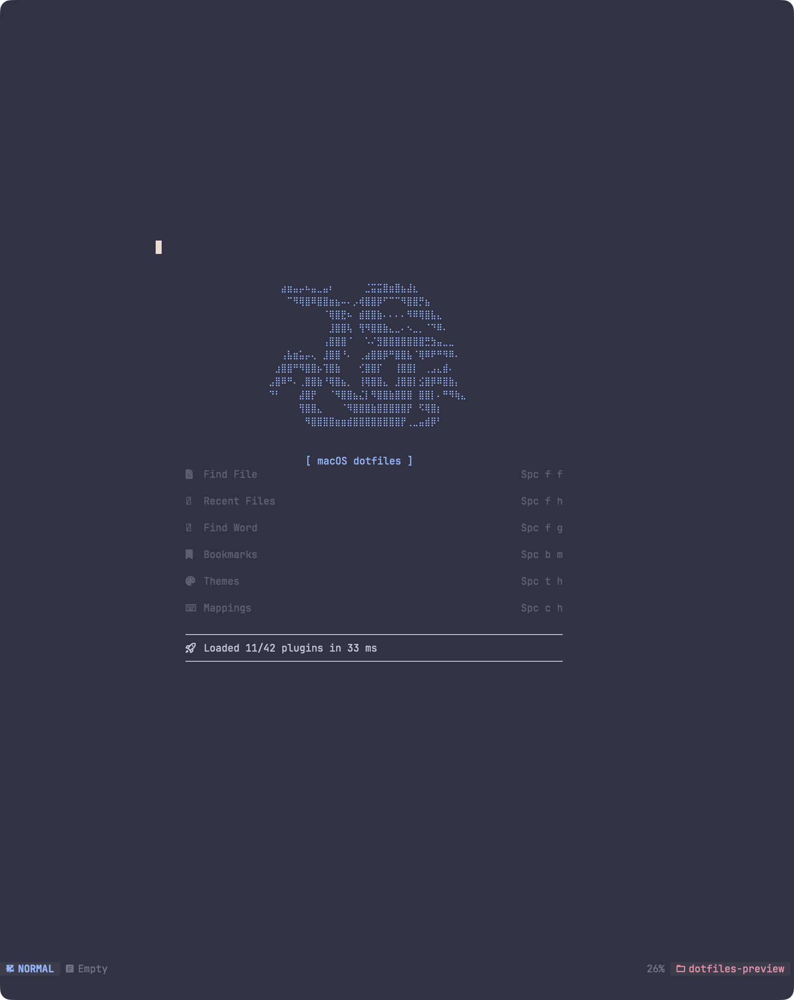

# macOS dotfiles

Portable macOS configuration managed as one GNU Stow package.

## Managed configuration

- Fish, Starship, Alacritty, Neovim, and tmux
- Sketchybar, yabai, skhd, and Karabiner-Elements
- Shared terminal font and command-line dependencies required by these configurations

## Screenshots

### Sketchybar


### Terminal prompt



### tmux



### Neovim dashboard



## Fresh-machine setup

Clone the repository anywhere, then preview the exact links before applying them:

```sh
git clone git@github.com:OSfrog/dotfiles.git ~/dotfiles
cd ~/dotfiles
./bootstrap --dry-run
./bootstrap --apply
```

`bootstrap` must run as your normal login user, never with `sudo`. It installs Homebrew when needed, installs the configured formulas and casks, checks for Stow conflicts, links the `osx` package, initializes Fisher, TPM, and Lazy.nvim, then starts the Sketchybar, yabai, and skhd user services.

The bootstrap installs Fish, Neovim, tmux, Starship, eza, Alacritty, Sketchybar, yabai, skhd, jq, fzf, fastfetch, ripgrep, fd, Node.js, Karabiner-Elements, and JetBrains Mono Nerd Font.

## Manual Stow commands

The package maps `osx/.config/...` to `$HOME/.config/...`. `--no-folding` is required: it leaves configuration directories real so Fisher, TPM, and applications can write their mutable state outside the repository.

```sh
# Preview
stow --no-folding --simulate --verbose=1 --dir="$PWD" --target="$HOME" osx

# Apply or refresh links
stow --no-folding --restow --verbose=1 --dir="$PWD" --target="$HOME" osx

# Remove links created by this package
stow --no-folding --delete --verbose=1 --dir="$PWD" --target="$HOME" osx
```

Never use `stow --adopt` against application state. If Stow reports a conflict, back up or reconcile that file manually before applying the package.

For testing against an isolated directory, set `DOTFILES_TARGET` when invoking the bootstrap:

```sh
DOTFILES_TARGET="$(mktemp -d)" ./bootstrap --dry-run
```

## Per-machine behavior

The Fish configuration derives home-directory paths from `$HOME` and only adds optional integrations when they are installed: Android SDK, Bun, pnpm, NVM, Antigravity, custom scripts, Starship, and eza. The GitHub package token is read from the macOS Keychain only when present.

Alacritty resolves Fish through `PATH`, so Intel and Apple Silicon Homebrew prefixes both work. Sketchybar adds its battery item only when `pmset` reports a battery.

## macOS approval steps

macOS requires interactive user approval for privileged desktop integrations. After bootstrap:

1. Enable **Accessibility** for yabai and skhd.
2. Enable **Accessibility** and **Input Monitoring** for Karabiner-Elements.
3. Open Karabiner-Elements once and approve its system extension if prompted.

The bootstrap intentionally does not use `sudo`, disable SIP, alter privacy databases, or change your login shell.
